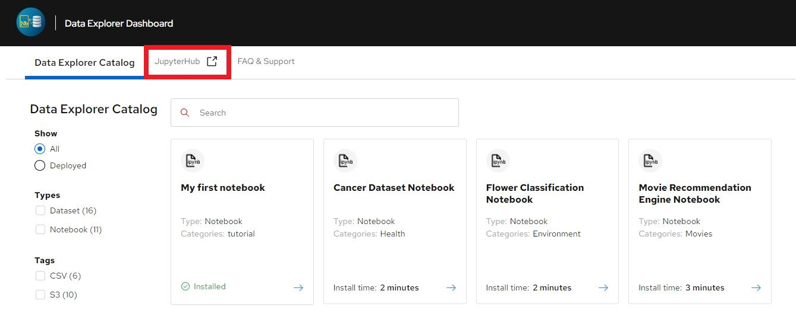
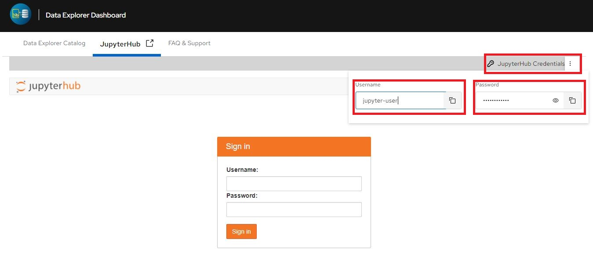
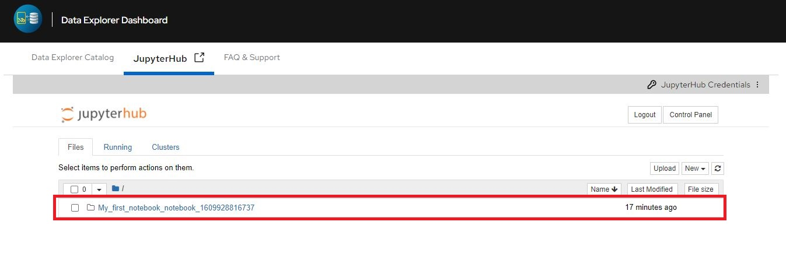

# My first notebook

Click the "Deploy Notebook" button above. You've just deployed your first notebook in Data explorer. Follow these instructions to access the deployed notebook

1. Click "JupyterHub" to access the jupyterhub authentication page.

2. The Username and password can be copied from "JupyterHub Credentials" at the top right corner.

3. Provide the username and password to access the Jupyterhub tree, where "My-first-notebook" can be found.

