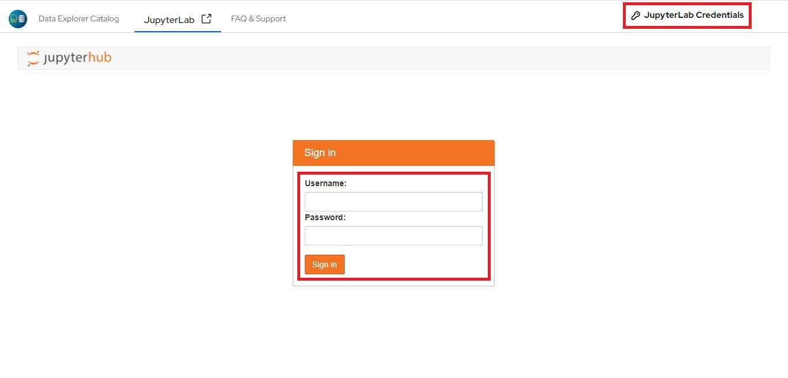

# My first notebook

Click the "Deploy Notebook" button above, if you haven't already and follow these instructions to access the deployed notebook

1. Click "JupyterLab" to access the jupyterhub authentication page.

2. Copy the username and password from "Jupyterlab Credentials" at the top right corner, and provide them in the Jupyterhub authentication fields to sign in.

3. Double click "My-first-notebook" python notebook, which is present in the left panel in Jupyterlab to open it.

**Note**: Jupyterlabs can only open files which are UTF-8 encoded. If a file isn't UTF-8 encoded and must be accessed in Jupyterlabs, it can be downloaded and locally converted in your computer, and then uploaded to work with.

An error similar to the one shown below will be displayed, if a non UTF-8 encoded file is opened.

